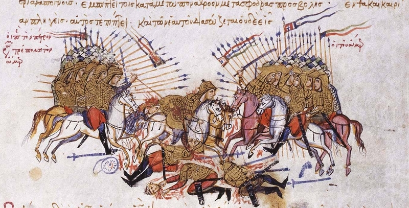

:css: css/slides.css
:skip-help: true

.. title: Sweden: A baltic culture

----

Swedish culture
===============

.. image:: images/europe.png

.. note::

    Sweden is a tall and narrow country. It's large but only 9 million
    persons live there. Poland has almost 4 times as many people.

----

Culture rooted in history
=========================

.. note::

    Swedish culture can be very modern and forward looking, and it can
    be rooted in history, and sometimes both at the same time.

    Because in Sweden, evidence of history is always just around the corner.

----

.. image:: images/stone-age.svg
    :width: 100%

.. note::

    Farming arrived in Sweden around 6000 years ago, during what is called
    the new stone age.

----

.. note::

    The stone age farmers made monuments over the graves of important people.
    Sometimes just a simple large stone, and sometimes they made big
    monuments, like the one you see here.

----

.. note::

    Then the bronze age came to Sweden, and with it a new culture.

----

.. image:: images/Kongshögen_130103x.jpg
    :width: 100%

.. note::

    Bronze age people stopped making large stone monuments, and started
    covering the graves in a mound of smaller stones.

    The more important a person was, the bigger the mound. This one is called
    Kings Mound (Kopiec Królowy?) and legend has it that a king is buried
    there. This is almost certainly not true, but whoever is buried here must
    have been very important and rich, to have a mound this large.

----

.. note::

    We also get the first Scandinavian art with stone carvings.
    Can you guess what this shows?

    Yes, large boats. Each of the little dash in the boat is a man.

----

.. note::

    During the iron age weather got colder, and farming got harder.

----

.. image:: images/djurornamentik.png
    :height: 750px

.. note::

    Iron age people developed a style of art with long animals winding around
    and biting themselves in the tail.

----

.. note::

    Iron age people put their richest people into graves shaped like ships.

----

.. note::

    Because farming got hard, and winters longer, farmers would
    farm during summer and during winter would take their boats and trade
    around the baltic and atlantic.

    But there was a lot of wars and attacks all around Europe, so these
    farmer-tradesmen needed to know how to fight as well.

----

.. note::

    These people became known as Vikings, and we have the viking age!

----

.. note::

    Vikings is a culture developed in Denmark, Norway and Sweden.

    Vikings traded far and wide, with England, Italy, Byzantium and even the
    Arabic empires.

    The vikings were not just good at sailing, they were good at fighting.
    That's why they became so feared around Europe.

    Swedish Vikings founded Russia (yes, it's really true).
    Danish and Norwegian vikings invaded and took over England, several times,
    and one Danish viking was given a large part of France if he promised
    to stop attacking Paris.

----

.. note ::

    They took inspiration from all these cultures and
    developed their own style of clothes, jewellry and art, and of course
    their own religion, with famous gods like Thor and Odin.

----

.. note ::

    The emperor in Constantinople had his own personal body guard that was
    only made up of Vikings, and that's who you can see in this 1000 year
    old drawing from Byzantium.

----

.. note::

    In fact, one of them even carved some runes into the marble at
    Hagia Sophia, which was the most important church at that time.
    (It's also been a mosque and is now a museum.)

    Those carvings are more than a 1100 years old, and hard to read,
    but experts think it says "Halfdan carved these runes."

----

.. note::

    The vikings would still bury their richest people in ship graves, but the
    most common memory of the Vikings are the runestones. These are stones
    made to the memory of somebody. They are not gravestones, but are instead
    located near roads or at holy places, so many people can see them.

    Often the runestones mention people who died while in a country far away.

    Runestones are carved with a special alphabet called "runes".
    They are designed to be easy to carve especially in wood.
    For that reason they were used in some parts of sweden long after
    the viking age ended.

----

.. note::
    After the viking age comes the middle-ages. The vikings stopped
    invading everyone, and became Christian.

----

.. note::

    In the middle ages, the church became very powerful, and it became the
    center of art and culture.

    In Sweden we can notice this by looking at the extravagant paintings in
    old churches. Sweden developed it's own style of church decoration with
    very flowerly motifs.

----

.. note::

    Then we come to the renaissance, and another flowery style developed.

----

.. note::

    It's called kurbits, and has these large fantasy flowers.

----

.. image:: images/dalahäst.jpg
    :height: 800px

.. note::

    Most famously, it's used on the Dala horse, a wooden horse which has
    become a symbol of Sweden.

----

.. note::

    Swedes have stopped making huge stone monuments, but the
    connection to these monuments is still there.

    All these stone graves and the runestones were made to be seen.
    They were placed near roads or rivers where people went by, or by
    holy places where many people visited.

    It was a way of saying "We live here, and our fathers lived here,
    this is our land."

    As an example, this is a field with graves from the Stone age in the small
    town where Elenor's dad grew up.

----

.. note::

    Just on the other side of the train tracks is a medieval church.

----

.. note::

    But in front of the church is a viking age runestone.
    And in the church yard is a bronze age grave.

    People have lived here for 6000 years,
    and you can see it every day, when you walk over the Stone age
    burial field, or drive by a bronze age mound.

    History in Sweden is always very nearby.

----

The magic of nature
===================

.. note::

    Swedish people likes nature, and can sometimes see it almost as magical.

----

.. note::

    Man people have or want to have a small summer house close to nature,
    maybe out in the deep forest, close to a lake.

----

.. note::

    It's popular to get close to nature by pick mushrooms or berries,
    or go fishing or hunting.

    Elenor was helping her Dad and his friend to fish crayfish this summer.

    Eating Crayfish is a Swedish tradition in August. They taste a little
    bit like something inbetween lobsters and shrimp.

----

.. note::

    When the Stockholm government tore down old beautiful houses in Stockholm
    to build new ugly boxes, nobody protested. But when they wanted to cut
    down some elm trees (Wiąz) to build a subway station, thousands of
    people protested and even had fights with the police.

    The elms got to stay, the subway station was built elsewhere.

----

.. note::

    In Swedish culture, nature is full of magical creatures, and Swedish
    children stories are full of stories about evil trolls and funny gnomes
    living underground. The gnomes can cause a lot of trouble, especially if
    you make them angry.

----

.. image:: images/gårdstomte.jpg
    :width: 100%

.. note::

    But the most important gnome is the the house gnome. He lives on farms
    and will secretly help and protect the farm, especially the animals.

    But if the farmer treats the animals badly, or disrespect him, he can
    make things break, and make the harvest go bad.

    Children in Sweden will still put out a plate of porridge for the house
    gnome for christmas, to thank him for the year.

----

.. note::

    For more than a 100 years there have been a book series called
    "Amongst Gnomes and Trolls" with a new book every Christmas of
    magical childrens stories.

----

.. note::

    Many of our most famous painters also paints nature.
    Bruno Liljefors is famous for his animal paintings.

----

.. image:: images/kräftfiske.jpg
    :width: 100%

.. note::

    But the most popular Swedish painter is probably Carl Larsson.
    He painted a lot of nature, or his house and family.
    Here is a painting of his family fishing Crayfish.

----

.. note::

    Carl Larsson's wife Karin was also an artist, and she made art that was
    quite modern for the time, and designed all the textiles and much of the
    furniture in their home.

----

.. note::

    She designed a home that has become a sort of ideal home for much of
    Sweden, and really started what is the "Swedish style".

----

A culture looking at the future
===============================

.. note::

    Karin and Carl Larsson were not the only ones modernizing Sweden.

    Despite all the history, Swedish culture is very modern and inventive.

----

.. image:: images/Carl_von_Linné.jpg
    :height: 800px

.. note::

    Sweden have had many important scientists, the famous one is Karol
    Linneusz, who you see here. He is the one who created the
    system of nature, classifying plants and animals into
    kingdoms, classes, orders, genera and species.

    You have probably also hear that we measure temperature in degrees Celsius.
    This is from Anders Celsius, a Swedish chemist.

----

.. note::

    But Swedens inventors have been even more important. This is Alfred
    Nobel, he invented dynamite. That made him very rich, and much of his
    money went to start the Nobel Prize, which are some of the most important
    prizes for sciences and also the most important prize for peace.

----

.. note::

    The milk and juice carton is a Swedish invention!

----

.. note::

    Pas bezpieczeństwa, Zamek błyskawiczny, Klucz nastawny,
    all Swedish inventions.

    In Poland this type of Klucz is often called
    Klucz szwedzki.

----

.. note::

    Today you are used to taking your furniture home in a box and putting it
    together yourselves. But that started in Sweden, with a company you
    certainly have heard of.

----

.. note::

    IKEA!

    Although IKEA is an international company with shops all around the world,
    they look very much to Sweden for inspiration.

----

.. note::

    Do you remember the flowery patterns called Kurbits?
    IKEA has used that style a lot.

    And the pattern of blue stripes?

----

.. image:: images/Carl_Larsson-Lathörnet.jpg
    :width: 100%

.. note::

    It's inspired by Carl and Karin Larssons home.
    IKEA takes a lot from there.

----

.. note::

    Like this chair.

----

.. image:: images/karin-larsson-kök.jpg
    :width: 100%

.. note::

    This is a picture from Carl and Karin Larsson's dining room.

----

.. image:: images/ikea-kök.jpg
    :width: 50%

.. image:: images/ikea-stol.jpg
    :width: 50%

.. note::

    And this is furniture you can by at IKEA.

    Do you recognize the style?

----

.. note::

    It's not only IKEA who is inspired by Karin Larssons designs. H & M,
    which is also a Swedish company, has made several dresses inspired by
    Karin Larsson.

----

Children in Sweden
==================

.. note::

    Children in Sweden are taken seriously.

    In 1979 Sweden made it illegal parents to spank children. It was the
    first country in the world to do so.

    When a child is born, parents get one and a half year off work to spend
    with their children.

----

.. note::

    Sweden also have a long tradition of making childrens books.
    And I'm sure you all have heard about Pippi Pończoszanka.

    Astrid Lindgren wrote not only those books, but many, many
    childrens books that are still the most popular childrens books in Sweden.
    Dzieci z Bullerbyn, Bracia Lwie Serce, Emil ze Smalandii, and many more.

    They are popular because they take children seriously, and do not treat
    them as stupid. The result is books that can be enjoyed by all ages,
    and since Astrid Lindgren, writing childrens books is seen as just as
    fancy as writing adult books.

----

.. note::

    As a result, Sweden have now many really good childrens authors that are
    popular in many countries, like Poland.

    These are new Swedish books that I found on the front page of the
    Empik website. You read a lot of Swedish childrens books in Poland.

----

Open and progressive
====================

----

.. note::

    Sweden has also been in the forefront for human rights. Men and women
    have the same rights, and are the most equal in the world. For example,
    many dads are taking time off from their job to stay home with their kids
    when they are small, just like their mothers do.

----

.. note::

    Sweden has a lot of immigrants and took refugees both from Poland during
    communism, and Yugoslavia when communism collapsed and now we have many
    refugees from the war in Syria.

----

.. note::

    Minorities have strong rights in Sweden. You can join any religion
    you want, or none at all.

----

.. note::

    You can get married with whoever wants to marry you, boys with boys,
    and girls with girls.

----

.. note::

    Sweden is dedicated to peace. We have not been involved in a war for more
    than 200 years. Much of our army helps the United Nations peace keeping,
    currently in 20 different countries.

----

Questions?
==========

.. image:: images/europe.png
